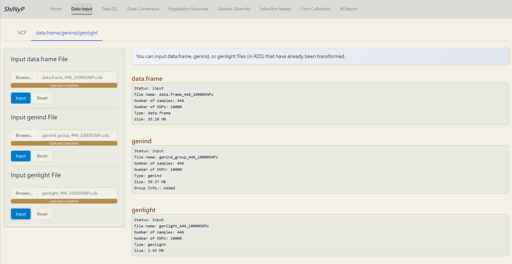

# Data Input {#sec-data-input}

::: {.highlighted-text style="padding-top: 15px; padding-bottom: 1px; padding-left: 15px"}
➡️ This section contains two subpages: [**VCF**]{.underline} and [**data.frame/genind/genlight**]{.underline}, allowing you to upload various data types for analysis.
:::

## VCF

##### Required Dataset (one of the following): {.unnumbered}

-   VCF file from PLINK

-   VCF or gzipped VCF (vcf.gz) file from VCFtools

-   VCF file in RDS format from [***ShiNyP***]{style="color: #9D6853;"}

The VCF file should contain chromosome and position information in the first two columns ([**`#CHROM`**]{style="color: #8b0000;"} and [**`POS`**]{style="color: #8b0000;"}), along with sample names and their genotypic information. For some whole genome sequencing (WGS) data, where SNP marker ID information is missing, [***ShiNyP***]{style="color: #9D6853;"} will auto-generate the SNP ID names as [#CHROM:POS]{.underline}, such as [2:12500]{.underline}, indicating chromosome 2, position 12500.

##### Step 1: Input your VCF File {.unnumbered}

1.  [Browse]{style="background-color: #e7eaed;"} and upload one VCF file.

2.  If your VCF file is from VCFtools, please tick the 'VCF file from VCFtools' checkbox.

3.  After the progress bar shows 'Upload complete', click the [**Input VCF File**]{style="color: #fff;background-color: #007ACC;"} button.

*Or use our Demo Data*

1.  Click the [**Use Demo Data**]{style="color: #fff;background-color: #007ACC;"} button and select one species. Detailed descriptions of the demo datasets are available at [https://reurl.cc/QEx5lZ (Google Drive)](https://reurl.cc/QEx5lZ).

> **Note:** By default, the genotypic information for 5 samples and 10 SNPs will be displayed on the interactive table.

##### Step 2: Transform to data.frame {.unnumbered}

1.  If you have already input a VCF file on [***ShiNyP***]{style="color: #9D6853;"}, click the [**Transform to data.frame**]{style="color: #fff;background-color: #007ACC;"} button.

2.  Download the [**`data.frame`**]{style="color: #8b0000;"} file (in RDS format) and Site Info (in RDS format) so that you will not have to input the VCF file again; instead, you can upload the [**`data.frame`**]{style="color: #8b0000;"} file.

##### Outputs: {.unnumbered}

-   **VCF Data (RDS)**: VCF data stored in RDS format, which can be open and read in R environment.

-   **data.frame (RDS)**: [**`data.frame`**]{style="color: #8b0000;"} file. It's necessary for downstream analyses, *please download and save it!*

-   **Site Info. (RDS)**: SNP site information file. It's necessary for downstream analyses, *please download and save it!*

> **Note:** If your data is large (more than 1GB), it may take some time to process. Please be patient. The [***ShiNyP***]{style="color: #9D6853;"} platform processes one task at a time (e.g., you must wait for the input process to finish before you can reset the data).

{width="800"}

*VCF Data Input!*

## data.frame/genind/genlight

##### Required Dataset: {.unnumbered}

-   [**`data.frame`**]{style="color: #8b0000;"} in RDS file format

-   [**`genind`**]{style="color: #8b0000;"} in RDS file format

-   [**`genlight`**]{style="color: #8b0000;"} in RDS file format

| [**`data.frame`**]{style="color: #8b0000;"} file can be downloaded from the subpages [VCF]{.underline}, [Sample QC]{.underline}, and [SNP QC]{.underline}.
| [**`genind`**]{style="color: #8b0000;"} and [**`genlight`**]{style="color: #8b0000;"} files can be downloaded from the [Data Conversion]{.underline} page.

##### **One Step:** {.unnumbered}

1.  [Browse]{style="background-color: #e7eaed;"} and click the [**Input**]{style="color: #fff;background-color: #007ACC;"} button to upload your [**`data.frame`**]{style="color: #8b0000;"}, [**`genind`**]{style="color: #8b0000;"}, and [**`genlight`**]{style="color: #8b0000;"} files.

{width="800"}

[***`data.frame`***]{style="color: #8b0000;"}*/[**`genind`**]{style="color: #8b0000;"}/[**`genlight`**]{style="color: #8b0000;"} Data Input!*
