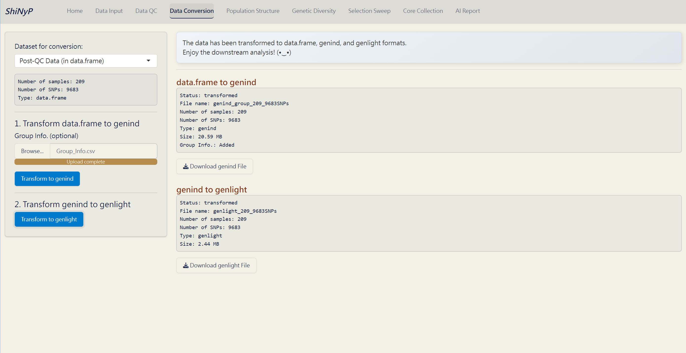

# Data Transform {#sec-data-conversion}

::: {.highlighted-text style="padding-top: 15px; padding-bottom: 1px; padding-left: 15px"}
➡️ This section allow you to convert your SNP data in [**`data.frame`**]{style="color: #8b0000;"} into [**`genind`**]{style="color: #8b0000;"} and [**`genlight`**]{style="color: #8b0000;"}.
:::

##### Required Dataset (one of the following): {.unnumbered}

-   Input VCF Data ([**`data.frame`**]{style="color: #8b0000;"} file) from the [Data Input]{.underline} page.

-   Post-QC Data ([**`data.frame`**]{style="color: #8b0000;"} file) from the [Data QC]{.underline} page.

##### Step 1: Transform [**`data.frame`**]{style="color: #8b0000;"} to [**`genind`**]{style="color: #8b0000;"} {.unnumbered}

Click the [**Transform to genind**]{style="color: #fff;background-color: #007ACC;"} button. This will generate the [**`genind`**]{style="color: #8b0000;"} file.

> **Note:** After obtaining the clustering results from the [Population Structure]{.underline}/[DAPC]{.underline} subpage, you can add **Group Info.** to the [**`genind`**]{style="color: #8b0000;"} file by inputting the ‘**DAPC_Group_Info.csv**’. This step is necessary for analyses like ‘Genetic Distance’ and ‘AMOVA’.

##### Step 2: Transform [**`genind`**]{style="color: #8b0000;"} to [**`genlight`**]{style="color: #8b0000;"} {.unnumbered}

Click the [**Transform to genlight**]{style="color: #fff;background-color: #007ACC;"} button. This will generate the [**`genlight`**]{style="color: #8b0000;"} file.

##### Outputs: {.unnumbered}

-   **genind (RDS)**: [**`genind`**]{style="color: #8b0000;"} file. It's necessary for downstream analyses, *please download and save it!*

-   **genlight (RDS)**: [**`genlight`**]{style="color: #8b0000;"} file. It's necessary for downstream analyses, *please download and save it!*

> **Note:** Please download and save your [**`data.frame`**]{style="color: #8b0000;"}, [**`genind`**]{style="color: #8b0000;"}, and [**`genlight`**]{style="color: #8b0000;"} files after transformation. This will save you from having to input the large VCF file again next time.

*Data Transformation Complete!*
