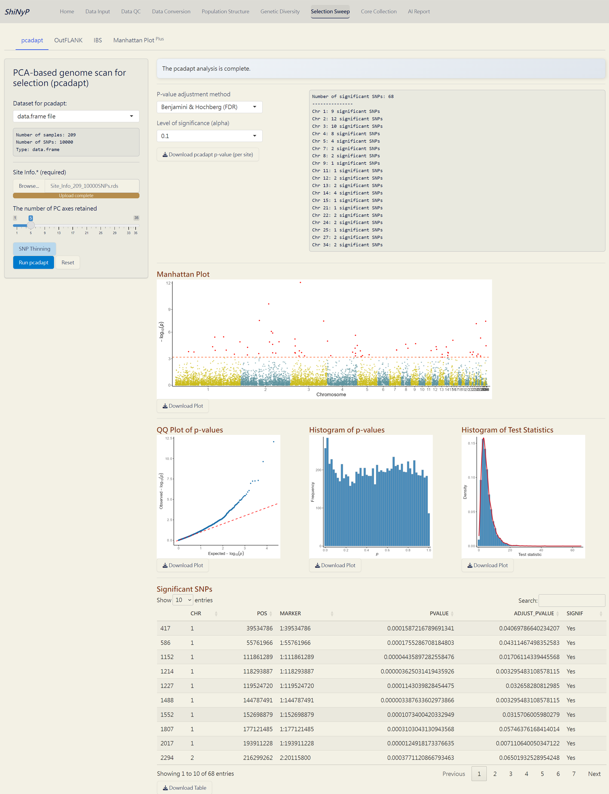
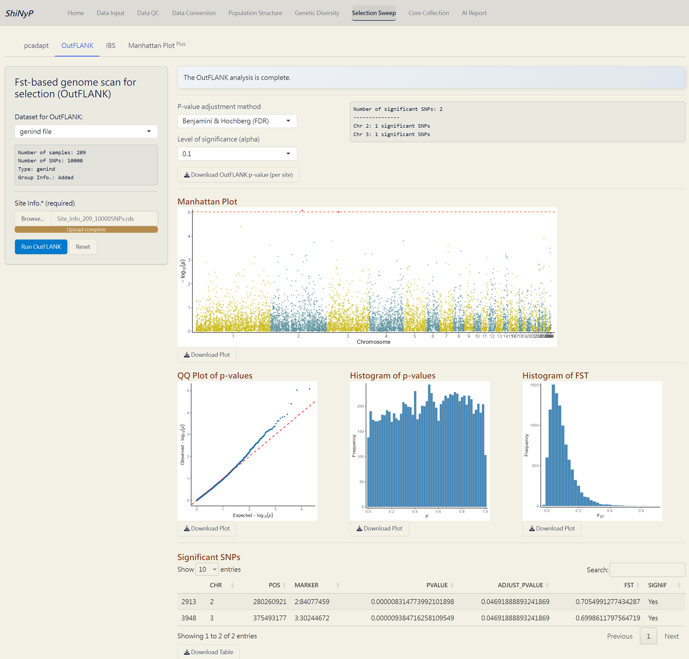
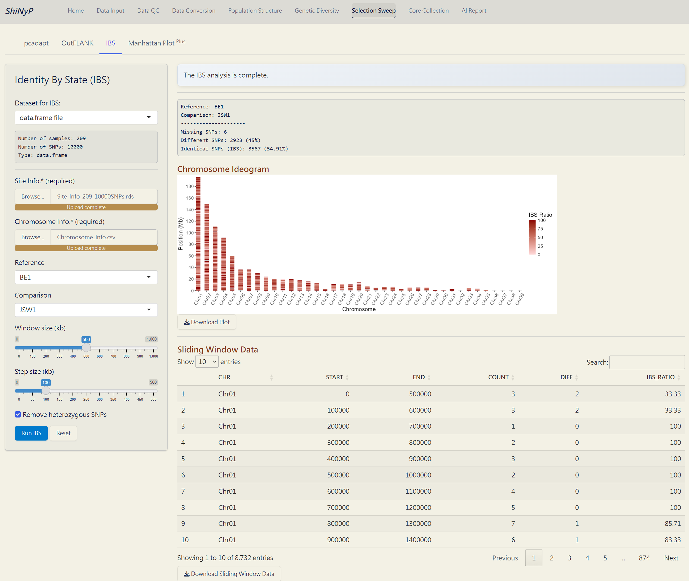
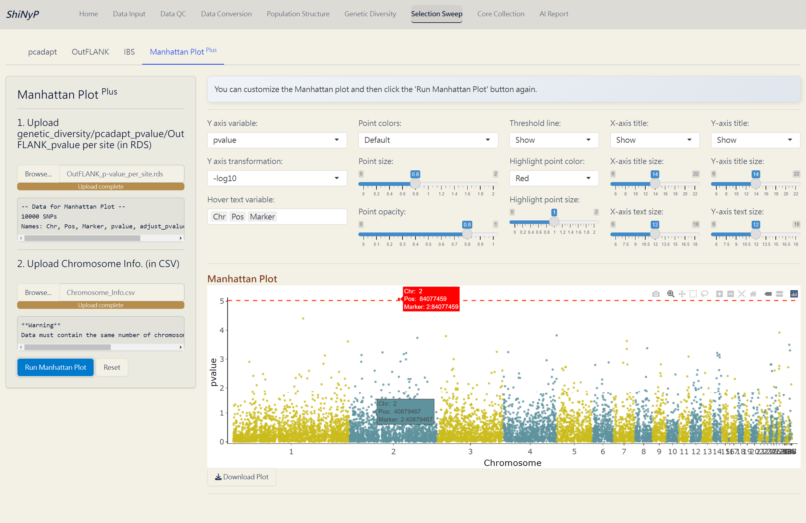

# Selection Sweep {#sec-selection-sweep}

::: {.highlighted-text style="padding-top: 15px; padding-bottom: 1px; padding-left: 15px"}
➡️ This section contains four subpages: [**pcadapt**]{.underline}, [**OutFLANK**]{.underline}, [**IBS**]{.underline}, and [**Manhattan Plot**]{.underline}^**Plus**^, allowing you to detect selection signatures in different scenario and customize your plot.
:::

## pcadapt

A PCA-based approach identifies selective outliers relative to population structure [@Luu2017].

##### Required Datasets: {.unnumbered}

-   [**`data.frame`**]{style="color: #8b0000;"}
-   **Site Info.** **(RDS)** of the current [**`data.frame`**]{style="color: #8b0000;"}, downloadable from [Data Input]{.underline} or [Data QC]{.underline} pages.

##### **Steps:** {.unnumbered}

1.  [Upload]{style="background-color: #fceed2;"} **Site Info.** (required).

2.  Click [SNP Thinning]{style="color: #fff;background-color: #007ACC;"} button (optional) and choose window size (number of SNPs) and r² threshold. For more information, visit <a href="https://bcm-uga.github.io/pcadapt/articles/pcadapt.html" target="_blank">https://bcm-uga.github.io/pcadapt/articles/pcadapt.html</a>.

3.  Click the [**Run pcadapt**]{style="color: #fff;background-color: #007ACC;"} button to perform genome scan for selection.

##### Outputs: {.unnumbered}

-   **pcadapt p-value per site (RDS)**: A dataset containing p-values and adjusted p-values for each site.

-   **pcadapt Manhattan Plot (PDF)**: A Manhattan plot visualizing the p-values per site across the genome. Significant SNPs are highlighted in red.

-   **pcadapt QQ Plot (PDF)**: A QQ plot comparing the distribution of observed p-values to the expected distribution under the null hypothesis.

-   **pcadapt Histogram of p-values (PDF)**: A histogram showing the distribution of p-values across all sites.

-   **pcadapt Histogram of Test Statistics (PDF)**: A histogram showing the distribution of test statistics across all sites.

-   **pcadapt Significant SNPs (CSV)**: A table listing SNPs identified as significant by pcadapt, including their site info., p-values, and adjusted p-values.

*The pcadapt Complete!*

## OutFLANK

A Fst-based approach detects selection signals by comparing genetic differentiation between defined group assignments [@whitlock2015]. For more information, visit <a href="https://rpubs.com/lotterhos/outflank" target="_blank">https://rpubs.com/lotterhos/outflank</a>.

##### Required Datasets: {.unnumbered}

-   [**`genind`**]{style="color: #8b0000;"} with 'Group Info.', downloadable from [Data Conversion]{.underline} page after you have both the [**`data.frame`**]{style="color: #8b0000;"} and Group Info.
-   **Site Info.** **(RDS)** of the current [**`data.frame`**]{style="color: #8b0000;"}, downloadable from [Data Input]{.underline} or [Data QC]{.underline} pages.

##### **Steps:** {.unnumbered}

1.  [Upload]{style="background-color: #fceed2;"} **Site Info.** (required).

2.  Click the [**Run OutFLANK**]{style="color: #fff;background-color: #007ACC;"} button to perform genome scan for selection.

##### Outputs: {.unnumbered}

-   **OutFLANK** **p-value per site (RDS)**: A dataset containing p-values and adjusted p-values for each site.

-   **OutFLANK** **Manhattan Plot (PDF)**: A Manhattan plot visualizing the p-values per site across the genome. Significant SNPs are highlighted in red.

-   **OutFLANK** **QQ Plot (PDF)**: A QQ plot comparing the distribution of observed p-values to the expected distribution under the null hypothesis.

-   **OutFLANK** **Histogram of p-values (PDF)**: A histogram showing the distribution of p-values across all sites.

-   **OutFLANK** **Histogram of Fst (PDF)**: A histogram showing the distribution of Fst values across all sites.

-   **OutFLANK** **Significant SNPs (CSV)**: A table listing SNPs identified as significant by OutFLANK, including their site info., Fst values, and p-values.

*The OutFLANK* *Complete!*

## IBS (Identity By State)

An approach to detect differences in genomic regions between pairs of individuals, useful for identifying pedigree relationships.

##### Required Datasets: {.unnumbered}

-   [**`data.frame`**]{style="color: #8b0000;"}
-   **Site Info.** **(RDS)** of the current [**`data.frame`**]{style="color: #8b0000;"}, downloadable from [Data Input]{.underline} or [Data QC]{.underline} pages.
-   **Chromosome Info.** **(CSV)**: Reference genome information of the current study. For more details about this file, refer to **Section** \@ref(snp-density) **(SNP Density)**.

##### **Steps:** {.unnumbered}

1.  [Upload]{style="background-color: #fceed2;"} **Site Info.** (required).

2.  [Upload]{style="background-color: #fceed2;"} **Chromosome Info.** **(CSV)** (required).

3.  Choose the reference and comparison samples.

4.  Select window size (kb) and step size (kp).

5.  To remove heterozygous SNPs from the reference sample, click the [Remove heterozygous SNPs]{style="color: #fff;background-color: #007ACC;"} checkbox (optional).

6.  Click the [**Run IBS**]{style="color: #fff;background-color: #007ACC;"} button to perform IBS analysis.

##### Outputs: {.unnumbered}

-   **Chromosome Ideogram (PDF)**: An ideogram visualizing the IBS results, using a gradient palette to represent the differences across chromosomes.

-   **Sliding Window Data (CSV)**: A sliding window dataset with IBS results, including SNP count, different SNPs, and the ratio of different SNPs per window.

*The IBS Complete!*

## Manhattan Plot ^Plus^

Customize your phylogenetic tree plot based on the results from [Genetic Diversity]{.underline}/[Diversity Parameter]{.underline}, [Selection Sweep]{.underline}/[pcadapt]{.underline}, or [Selection Sweep]{.underline}/[OutFLANK]{.underline}.

##### Required Files: {.unnumbered}

-   **Genetic Diversity per Site** (Genetic_Diversity_per_Site.rds), **pcadapt p-value per Site** (pcadapt_p-value_per_site.rds), or **OutFLANK p-value per Site** (OutFLANK_p-value_per_site.rds).
-   **Chromosome Info.** **(CSV)**: Reference genome information of the current study. For more details about this file, refer to **Section** \@ref(snp-density) **(SNP Density)**.

##### **Steps:** {.unnumbered}

1.  [Upload]{style="background-color: #fceed2;"} **genetic_diversity/pcadapt_pvalue/OutFLANK_pvalue per site (RDS)**.

2.  [Upload]{style="background-color: #fceed2;"} **Chromosome Info. (CSV)**.

3.  Click the [**Run Manhattan Plot**]{style="color: #fff;background-color: #007ACC;"} button to generate the Manhattan plot.

4.  Customize the Manhattan plot and click the [**Run Manhattan Plot**]{style="color: #fff;background-color: #007ACC;"} button again.

##### Outputs: {.unnumbered}

-   **Manhattan** **Plot (PDF)**: A Manhattan plot with user-defined layout style and attributes.

> **Note**: If generating a plot for p-values, make sure to use '-log10' transformation for the Y axis.

*Manhattan* *Plot ^Plus^ Complete!*
