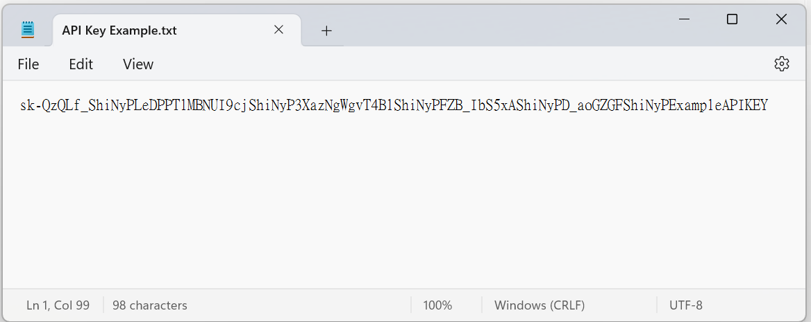

# AI Report {#sec-ai-report}

::: {.highlighted-text style="padding-top: 15px; padding-bottom: 1px; padding-left: 15px"}
➡️ This page allows you to generate your preliminary results from prior analysis, input your OpenAI API key, select an AI model, and get an AI-driven report. Powered by the *openai* package <a href="https://github.com/irudnyts/openai" target="_blank">https://github.com/irudnyts/openai</a>.
:::

##### Step 1: Preliminary Results {.unnumbered}

1.  Enter the species name for the current study.

2.  Click the [**Auto-generate**]{style="color: #fff;background-color: #00a595;"} button to obtain **Preliminary Results** from the [***ShiNyP***]{style="color: #9D6853;"} workflow.

> **Note**: You can download the Preliminary Results as a `.txt` file, edit it as needed, and upload it again for 'AI-driven Report' use.

##### Step 2: AI-driven Report {.unnumbered}

1.  Select an AI model. We recommend using **GPT-4o mini**, which offers the most cost-efficient performance. For more information, visit: <a href="https://platform.openai.com/docs/models" target="_blank">https://platform.openai.com/docs/models</a>.

2.  Specify the task for your Preliminary Results to OpenAI.

3.  Upload the `.txt` file containing your OpenAI API key (e.g., "sk-......").

    ▼ Example of API key file (TXT).

    {width="450"}

4.  Click the [**Get Report**]{style="color: #fff;background-color: #00a595;"} button to obtain **AI-driven Report**.

    ------------------------------------------------------------------------

##### **How to get the OpenAI API key**: {.unnumbered}

1.  **Sign Up or Log In** to the OpenAI website: <a href="https://platform.openai.com/docs/overview" target="_blank"><https://platform.openai.com/docs/overview></a>.

2.  **Check Your Usage** to track (free) credits and current consumption: <a href="https://platform.openai.com/usage" target="_blank"><https://platform.openai.com/usage></a>.

3.  If your (free) credits are **insufficient**, you can manage billing and payments by visiting: <a href="https://platform.openai.com/settings/organization/billing/overview" target="_blank"><https://platform.openai.com/settings/organization/billing/overview></a>.

4.  **Generate a New API Key** by going to: <a href="https://platform.openai.com/api-keys" target="_blank"><https://platform.openai.com/api-keys></a>.

5.  **Copy and Paste** the generated key into a Notepad file and save it as a `.txt` file for [***ShiNyP***]{style="color: #9D6853;"} use.

Upon signing up, OpenAI provides free credits valid for 3 months. After the free trial credits expire or are exhausted, you'll be billed based on your usage. Costs depend on the model and the number of tokens processed.

------------------------------------------------------------------------

##### Encountered an error? Let’s fix it! {.unnumbered}

Error: HTTP 401 Unauthorized

:   This error message indicates that your authentication credentials are invalid. This could happen for several reasons, such as:

    -   You are using a revoked API key.

    -   You are using a different API key than one under the requesting organization.

    -   You are using an API key that does not have the required permissions for the endpoint you are calling.

    To resolve this error, first check that you are using the correct API key and organization ID in your request header. You can find your API key and organization ID in your account settings [here](https://platform.openai.com/account/api-keys).

Error: Failed to Perform HTTP Request

:   This error may indicate that the request timed out, possibly due to an excessive input token count, which prevents the OpenAI model from completing the task within the allotted time.

    To resolve this issue, try selecting the 'GPT-3.5 Turbo' model to generate the report first. If successful, you can then switch to other models for subsequent tasks.
